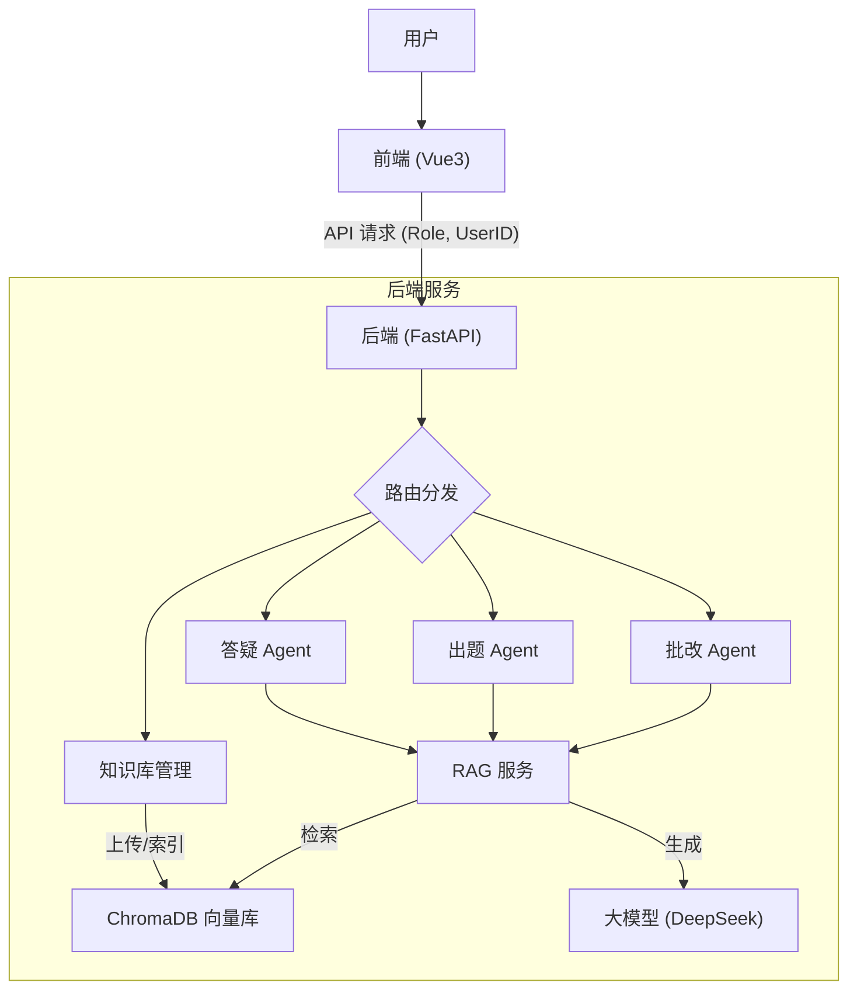

# 教学智能体系统架构与功能模块梳理

## 1. 系统整体架构 (System Architecture)

本系统采用 **前后端分离** 架构，基于 **RAG (检索增强生成)** 技术构建，旨在为高校新闻传播学教学提供多角色智能辅助。

### 技术栈
- **前端 (Frontend)**:
    - **框架**: Vue 3 + Vite
    - **UI 组件库**: Element Plus
    - **状态管理**: Pinia (管理用户会话、Agent 状态)
    - **样式**: SCSS
- **后端 (Backend)**:
    - **框架**: FastAPI (Python)
    - **大模型接口**: OpenAI SDK (兼容 DeepSeek V3)
    - **向量数据库**: ChromaDB (存储知识库向量)
    - **文档处理**: PyPDF, Python-docx (解析上传文件)

---

## 2. 核心逻辑机制 (Core Mechanisms)

### 2.1 用户与权限管理 (User & Role Management)
系统支持三种角色，通过 **2步登录流程** 进行身份认证：
1.  **教师 (Teacher)**: 侧重于教学辅助（出题、批改、备课）。
2.  **学生 (Student)**: 侧重于学习辅助（答疑、练习、自测）。
3.  **内部测试 (Internal Test)**: 特权角色，用于系统测试和数据验证。

### 2.2 知识库隔离机制 (Knowledge Base Isolation)
系统实现了严格的数据隔离，确保用户隐私：
- **默认知识库**: 系统内置的“新闻传播学理论知识库”，所有用户均可访问。
- **用户私有库**: 用户上传的文档仅自己可见（通过 `user_id` 标记）。
- **特权访问**: “内测管理员”角色拥有 **管理员视角 (Admin View)**，可以查看所有用户的知识库，并支持 **自由勾选** 特定用户的知识库进行定向测试。

### 2.3 2步登录工作流 (2-Step Login Workflow)
1.  **身份选择**: 用户选择角色。
2.  **知识库配置**:
    - **使用默认**: 直接进入系统，使用系统内置知识库。
    - **上传自定义**: 先上传私有文档，系统自动将其作为当前会话的知识库，然后进入系统。

---

## 3. 功能模块详解 (Functional Modules)

### 3.1 全局基础设施
- **知识库管理 (Global KB Management)**:
    - **入口**: 顶部导航栏“知识库管理”按钮（抽屉式面板）。
    - **功能**: 支持 PDF/Word/TXT 文件上传，实时构建向量索引。
    - **管理员功能**: 支持查看全量文件列表（按用户分组），并提供复选框以指定 AI 检索范围。
    - **定位**: 作为系统的底层基础设施，为所有 Agent 提供知识支持。

### 3.2 智能体矩阵 (Agent Matrix)
系统包含多个专注于特定任务的智能体：

#### A. 智能答疑助教 (Smart QA Assistant)
- **核心功能**: 基于 RAG 技术，根据知识库回答用户提问。
- **角色差异**:
    - **教师**: 用于测试知识库覆盖度，模拟学生提问。
    - **学生**: 用于日常课程答疑，获取知识点解析。
- **技术点**: 自动引用来源 (Source Citation)，支持多轮对话。

#### B. 智能出题助教 (Smart Quiz Assistant)
- **核心功能**: 根据指令自动生成试题（选择题等）。
- **角色差异**:
    - **教师**: 生成试卷，支持编辑和导出。
    - **学生**: 生成练习题，支持在线自测和即时反馈。
- **技术点**: 结构化 JSON 输出，自动解析题干、选项、答案和解析。

#### C. 智能批改助教 (Smart Grading Assistant)
- **核心功能**: 自动化作业批改与反馈。
- **角色差异**:
    - **教师**: **批量批改**。先生成评分标准 (Rubric)，然后批量上传学生作业，AI 自动打分并生成报表。
    - **学生**: **作业自查**。上传论文草稿，AI 从论点、逻辑、规范等维度给出修改建议（自动隐藏分数）。
- **技术点**: 评分标准生成，多文件批量处理，**上下文注入**（诊断结果自动同步至对话上下文，支持追问）。

#### D. 其他扩展助教 (规划中)
- **课件生成助教**: 辅助生成 PPT 大纲。
- **课程思政助教**: 挖掘课程思政元素。
- **学情分析助教**: 分析学习数据。
- **前沿资讯助教**: 追踪行业热点。
- **视频讲解助教**: 生成微课脚本。
- **就业指导助教**: 简历优化与模拟面试。

---

## 4. 数据流向图 (Simplified Data Flow)

